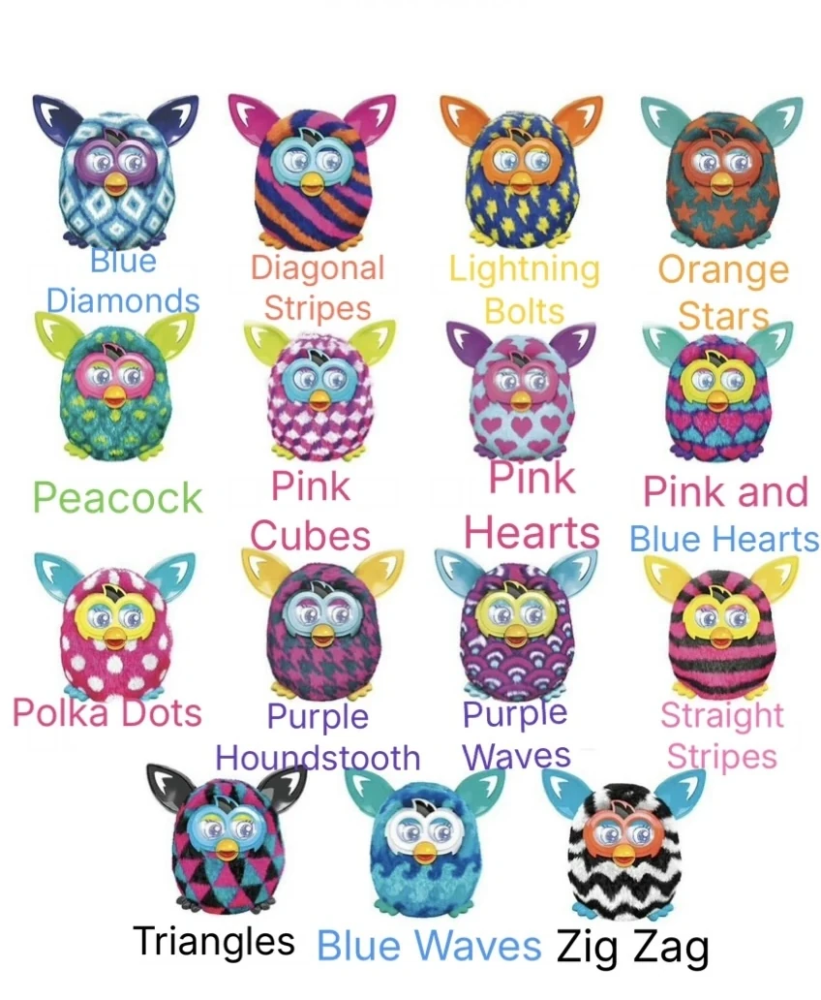

# Projeto-IOT
MARCO: Estamos vendo sobre lilnguagem de programação "PYTHON", aprendemos algumas variaveis (Int, Float e String), aprendemos também sobre Condicionais (If, Elif e Else) e os significados dos símbolos (ex:=, >, <, !) 
ALEXANDRE: Estamos fazendo um projeto de "Furby", criamos ele totalmente do zero para inovar, e estamos configurando o sistema do Furby.

